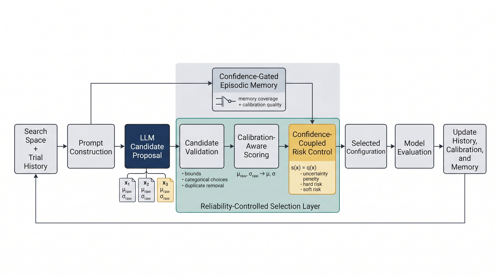

# Reliability-Controlled LLM-Guided Hyperparameter Optimization

[](environment/runtime_report.json)
[](docs/docker.md)
[](requirements.txt)
[](Dockerfile)
[](LICENSE)
[](docs/release_manifest.md)

Code, configs, figures, and minimal aggregate artifacts for the under-review
manuscript:

> **Reliability-Controlled LLM-Guided Hyperparameter Optimization for Low-Budget Mixed Search Spaces**

**Manuscript status:** under review. Citation metadata will be updated after a
public preprint or final publication becomes available.

<p align="center">
  
</p>

This repository is a manuscript-scope release artifact. It focuses on the
experiments reported in the current manuscript, with enough structure to
validate the released tables/figures and to adapt the HPO workflow to a custom
dataset.

## At a Glance

| Area | What this release provides |
|---|---|
| Manuscript reproduction | Configs and scripts for Exp1, Exp2, and ancillary Exp3 |
| Main evidence | Exp1 and Exp2 on CIFAR-100 |
| Diagnostic evidence | Exp3 as a failure-mode stress test, not cross-domain proof |
| Methods | Random/TPE-style baselines, LLM-guided proposals, calibration, risk control, episodic memory, ablations |
| Results | Aggregate metrics, seed-level convergence CSVs, checksummed manifests, manuscript figure PDFs |
| Custom use | Tabular CSV, text CSV, and image-folder HPO templates |
| Runtime | AutoDL micromamba snapshot plus Docker target for CUDA 11.8 |

## Contents

- [Why This Artifact Exists](#why-this-artifact-exists)
- [Repository Layout](#repository-layout)
- [Quick Start](#quick-start)
- [Docker Workflow](#docker-workflow)
- [Reproduce Manuscript Experiments](#reproduce-manuscript-experiments)
- [Released Results](#released-results)
- [Custom Dataset HPO](#custom-dataset-hpo)
- [LLM and API Key Use](#llm-and-api-key-use)
- [Validation and Integrity Checks](#validation-and-integrity-checks)
- [Environment](#environment)
- [Scope and Privacy](#scope-and-privacy)
- [Citation](#citation)
- [Contact](#contact)

## Why This Artifact Exists

Low-budget hyperparameter optimization in mixed search spaces can be brittle:
categorical choices, noisy early measurements, and sparse trial budgets make it
easy for a proposal mechanism to overreact to unreliable candidates. This code
release packages the manuscript workflow around a reliability-controlled
selection layer:


The LLM is used as a semantic proposal engine. Final selection is constrained by
candidate validation, uncertainty-aware scoring, risk penalties, and memory
gating. The release keeps the paper claims conservative: Exp1/Exp2 are the
primary empirical evidence, and Exp3 is included only as a diagnostic stress
test.

## Repository Layout

```text
.
|-- configs/
|   |-- paper/                 # Paper experiment configs
|   `-- templates/             # Custom dataset/search-space templates
|-- docs/
|   |-- custom_dataset_hpo_recipe.md
|   |-- docker.md
|   |-- installation.md
|   |-- llm_audit_and_prompt_schema.md
|   |-- release_manifest.md
|   `-- reproduce_paper_results.md
|-- environment/
|   |-- autodl_environment.yml
|   |-- autodl_pip_freeze.txt
|   `-- runtime_report.json
|-- examples/
|   |-- custom_data/
|   `-- minimal_runs/
|-- assets/                   # README overview image
|-- figures/                  # Released paper figure PDFs
|-- results/paper/             # Minimal aggregate paper results
|-- scripts/                   # Reproduction, summarization, validation
|-- src/                       # Optimizer, runners, baselines, utilities
|-- Dockerfile
|-- docker-compose.yml
|-- requirements.txt
|-- CITATION.cff
`-- LICENSE
```

## Quick Start

Use this path when you want to inspect the artifact, validate the files, or run
CPU-level smoke tests before launching GPU experiments.

```bash
pip install -r requirements.txt
cp .env.example .env
python scripts/validate_release_artifact.py
python -m src.custom_runner \
  --config examples/custom_data/tabular_csv/config.json \
  --method Random \
  --dry-run
```

For manuscript-level reproduction, use the environment snapshot under
[`environment/`](environment/) or the Docker workflow below. `requirements.txt`
is provided for convenience; the manuscript numbers should be checked against
the recorded AutoDL stack.

## Docker Workflow

The Docker target is Ubuntu 22.04 with CUDA 11.8:

```bash
docker build -t reliability-controlled-llm-hpo:cu118 .
docker run --rm --gpus all reliability-controlled-llm-hpo:cu118 \
  python scripts/validate_release_artifact.py
```

For compose-based runs:

```bash
cp .env.example .env
docker compose run --rm llm-hpo python scripts/validate_release_artifact.py
```

See [`docs/docker.md`](docs/docker.md) for server checks, GPU validation, mounted
paths, and paper-experiment commands inside Docker.

## Reproduce Manuscript Experiments

```bash
bash scripts/run_paper_experiments.sh exp1 --gpus 0,1,2
bash scripts/run_paper_experiments.sh exp2 --gpus 0,1,2
bash scripts/run_paper_experiments.sh exp3 --gpus 0,1,2
```

| Experiment | Role in manuscript | Config | Notes |
|---|---|---|---|
| Exp1 | Primary baseline comparison | [`configs/paper/exp1_baseline_comparison.json`](configs/paper/exp1_baseline_comparison.json) | CIFAR-100, 25-trial low-budget mixed search |
| Exp2 | Primary ablation study | [`configs/paper/exp2_ablation_study.json`](configs/paper/exp2_ablation_study.json) | Component-level evidence |
| Exp3 | Ancillary stress test | [`configs/paper/exp3_ancillary_stress_test.json`](configs/paper/exp3_ancillary_stress_test.json) | Diagnostic only |

LLM-based methods require `OPENAI_API_KEY`. Baseline methods and custom dry-runs
can be inspected without an API key.

## Released Results

The release intentionally includes compact, paper-facing result artifacts:

```text
results/paper/<experiment>/aggregate_metrics.csv
results/paper/<experiment>/convergence_by_seed.csv
results/paper/<experiment>/manifest.json
```

| Paper item | Released path |
|---|---|
| Figure 1 | [`figures/fig1_method_overview.png`](figures/fig1_method_overview.png) |
| Table 3, Figure 2 | [`results/paper/exp1_baseline/`](results/paper/exp1_baseline/) |
| Table 4, Figure 3, Figure 4 | [`results/paper/exp2_ablation/`](results/paper/exp2_ablation/) |
| Table 5 | [`results/paper/exp3_ancillary_stress_test/`](results/paper/exp3_ancillary_stress_test/) |
| Appendix seed-level results | `convergence_by_seed.csv` in each experiment folder |

Figure files are available under [`figures/`](figures/):

- [`figures/fig1_method_overview.png`](figures/fig1_method_overview.png)
- [`figures/fig2_exp1_bsf_trajectory.pdf`](figures/fig2_exp1_bsf_trajectory.pdf)
- [`figures/fig3_exp2_bsf_trajectory.pdf`](figures/fig3_exp2_bsf_trajectory.pdf)
- [`figures/fig4_exp2_component_effect.pdf`](figures/fig4_exp2_component_effect.pdf)

Regenerate aggregate result tables from local raw experiment outputs with:

```bash
python scripts/summarize_results.py
```

Regenerate the released manuscript figures with:

```bash
python scripts/generate_paper_figures.py
```

## Custom Dataset HPO

The release includes starter templates for using the HPO machinery on custom
data. The default recipe is a dry run: it validates configuration loading,
candidate generation, and output writing without launching a full training job.

```bash
python -m src.custom_runner \
  --config examples/custom_data/tabular_csv/config.json \
  --method Random \
  --dry-run
```

Supported starter layouts:

| Use case | Example config | Template |
|---|---|---|
| Tabular CSV classification | [`examples/custom_data/tabular_csv/config.json`](examples/custom_data/tabular_csv/config.json) | [`configs/templates/custom_tabular_csv.json`](configs/templates/custom_tabular_csv.json) |
| Text CSV classification | [`examples/custom_data/text_classification_csv/config.json`](examples/custom_data/text_classification_csv/config.json) | [`configs/templates/custom_nlp_text_csv.json`](configs/templates/custom_nlp_text_csv.json) |
| Image-folder classification | [`examples/custom_data/image_folder/config.json`](examples/custom_data/image_folder/config.json) | [`configs/templates/custom_cv_image_folder.json`](configs/templates/custom_cv_image_folder.json) |
| Search-space only | [`configs/templates/custom_search_space.json`](configs/templates/custom_search_space.json) | Edit for project-specific variables |

For full custom experiments, replace `evaluate_candidate` in
[`src/custom_runner.py`](src/custom_runner.py) with your training objective. Keep
domain-specific ranges conservative, especially for NLP learning rates; the
ancillary Exp3 diagnostic shows that naive transfer of CV-scale ranges can
produce poor results.

## LLM and API Key Use

Create `.env` from `.env.example` and set your key only in the local `.env` file:

```bash
cp .env.example .env
```

Do not commit `.env`, raw LLM logs, or provider responses. The release validator
checks for common leaked-key patterns and local paths.

Relevant implementation files:

| Component | File |
|---|---|
| Prompt construction | [`src/prompt_builder.py`](src/prompt_builder.py) |
| LLM client wrapper | [`src/unified_llm_client.py`](src/unified_llm_client.py) |
| Candidate acquisition | [`src/acquisition.py`](src/acquisition.py) |
| Calibration | [`src/calibration.py`](src/calibration.py), [`src/uncertainty_calibration.py`](src/uncertainty_calibration.py) |
| Risk-aware optimization | [`src/optimizer.py`](src/optimizer.py) |
| Episodic memory | [`src/episodic_memory.py`](src/episodic_memory.py) |

Prompt and audit details are summarized in
[`docs/llm_audit_and_prompt_schema.md`](docs/llm_audit_and_prompt_schema.md).

## Validation and Integrity Checks

Before uploading or sharing the artifact, run:

```bash
python scripts/validate_release_artifact.py
```

The validator checks:

- required manuscript-scope files
- forbidden suffixes such as checkpoints and Python bytecode
- forbidden folders such as cache, model, pilot, and raw logging directories
- common secret and local-path patterns
- JSON validity
- CSV schemas for released result files
- SHA-256 checksums in result manifests

The intended output is:

```text
Release artifact validation passed.
```

## Environment

The reference run used an AutoDL micromamba environment:

| Item | Value |
|---|---|
| OS | Ubuntu 22.04.5 LTS |
| Python | 3.10.19 |
| CUDA toolkit | 11.8 |
| PyTorch | 2.4.1+cu118 |
| torchvision | 0.19.1+cu118 |
| cuDNN | 90100 |
| GPUs | 3 x NVIDIA RTX 6000 Ada Generation |
| Environment manager | micromamba |

See:

- [`environment/runtime_report.json`](environment/runtime_report.json)
- [`environment/autodl_environment.yml`](environment/autodl_environment.yml)
- [`environment/autodl_pip_freeze.txt`](environment/autodl_pip_freeze.txt)
- [`docs/installation.md`](docs/installation.md)

## Scope and Privacy

This repository includes only manuscript-scope code, configs, figures, and compact
aggregate result files. It does not include:

- raw datasets
- model checkpoints
- API keys
- raw LLM logs
- provider response dumps
- per-trial raw dumps
- calibration state dumps
- episodic memory dumps
- proprietary model weights

Each released result folder contains a `manifest.json` with source metadata and
checksums for the included CSV files. See
[`docs/release_manifest.md`](docs/release_manifest.md).

## Citation

If this artifact helps your work before the manuscript is formally published,
please cite this repository using [`CITATION.cff`](CITATION.cff). The preferred
paper citation will be updated after a public preprint or final publication
becomes available.

```bash
cat CITATION.cff
```

## License

This artifact is released under the MIT License. See [`LICENSE`](LICENSE).

## Contact

For questions about this release artifact, contact asd8780@gmail.com.
